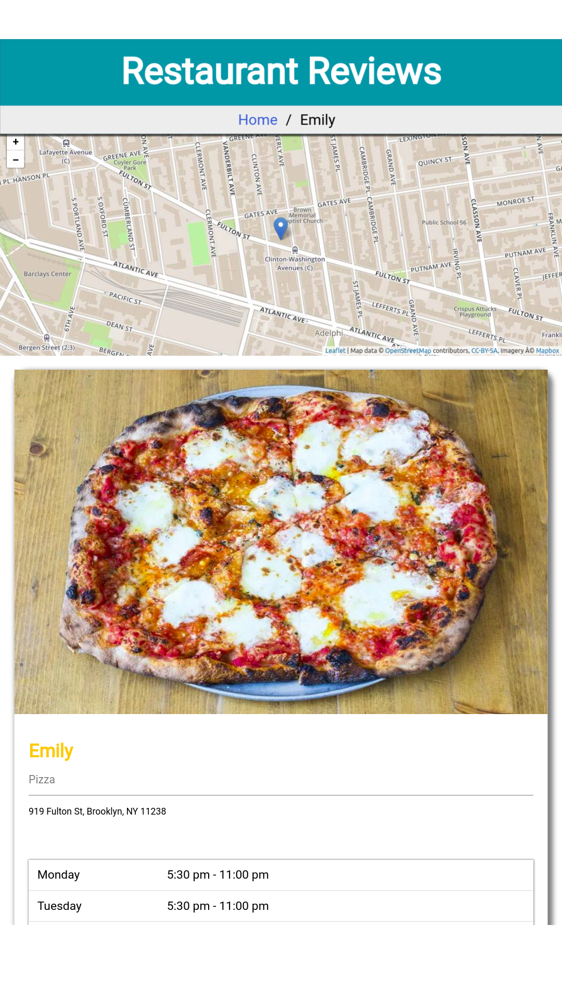
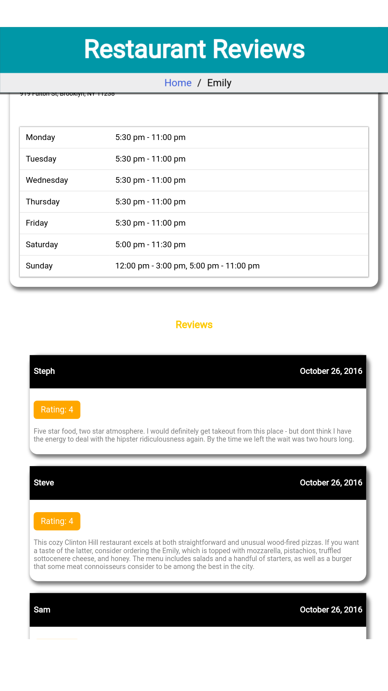
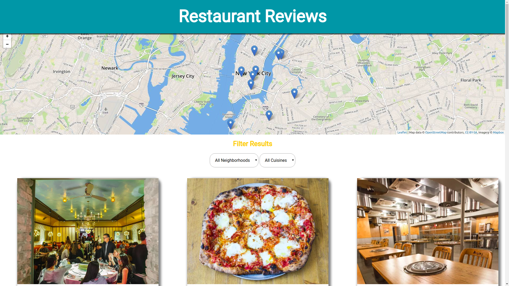
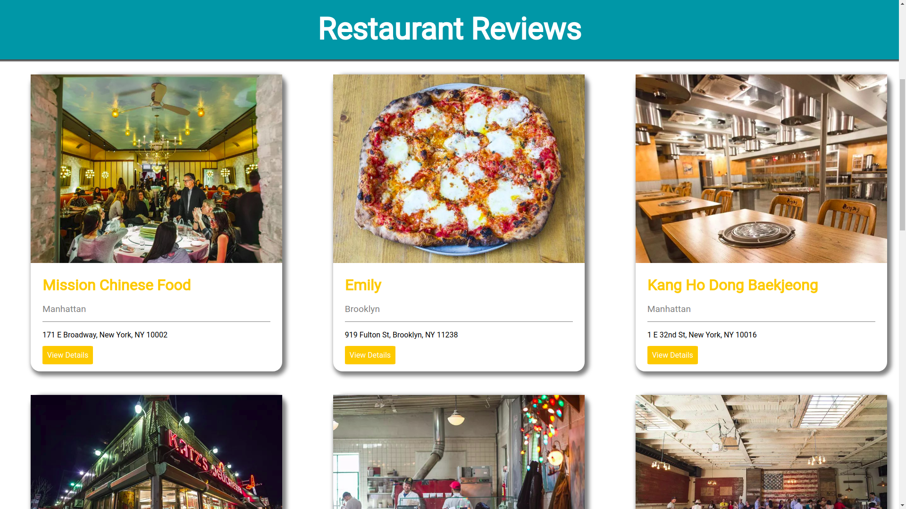

# Mobile Web Specialist Certification Course
---
#### _Three Stage Course Material Project - Restaurant Reviews_

## Online Demo here  [https://jatindhankhar.in/mws-restaurant-stage-1/](https://jatindhankhar.in/mws-restaurant-stage-1/)

## Features
### PWA - Ready and Accessbile

1. Offline First :heavy_check_mark:
2. Responsive and Mobile First :heavy_check_mark:
3. Accessible :heavy_check_mark:
## How to Run

1. In a terminal, check the version of Python you have: `python -V`. If you have Python 2.x, spin up the server with `python -m SimpleHTTPServer 8000` (or some other port, if port 8000 is already in use.) For Python 3.x, you can use `python3 -m http.server 8000`. If you don't have Python installed, navigate to Python's [website](https://www.python.org/) to download and install the software.

2. With your server running, visit the site: `http://localhost:8000`, and look around for a bit to see what the current experience looks like.

3. Try terminating the server with `CTRL + C ` and navigate the site, it should work offline as well

## How it Looks Like

|   |            |
|----------|:-------------:|
|  |   |
    

